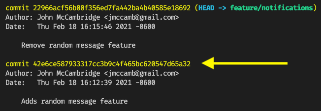

# Git Cherry-Pick

Sometimes you will work on code that has already been fixed or completed in another commit, by another developer. If that code hasn't been merged yet, how can you get those changes into your own branch?

`git cherry-pick` allows us to pull one or multiple commits into a branch. Let's consider an example of when this might be useful!

**Note**: For more information, see the [Git documentation on git cherry-pick](https://git-scm.com/docs/git-cherry-pick).

## Create an Example Repo

1. Inside this directory or another directory of your choosing, create a new folder called `git-cherry-pick`. Change into that directory and initialize it as a Git repository:

    ```sh
    mkdir git-cherry-pick
    cd git-cherry-pick
    git init
    ```

2. Now we will create `app.js`, `index.html`, and `README.md` files and add them to the repo. After that, we will commit everything as the initial commit:

    ```sh
    touch app.js index.html README.md
    git add .
    git commit -m "Initial commit"
    ```

3. Create a new branch, which will act as a placeholder for a branch that a coworker or teammate might have made. Let's name this branch as if the teammate is working on a new feature -- `feature/notifications`:

    ```
    git checkout -b feature/notifications
    ```

4. Now that the coworker has a branch of their own, let's add some code to make the app functional. Inside `index.html`, copy and paste the following snippet and save the `index.html`:

    ```html
    <html lang="en">
      <head>
        <meta charset="UTF-8" />
        <meta http-equiv="X-UA-Compatible" content="IE=edge" />
        <meta name="viewport" content="width=device-width, initial-scale=1.0" />
        <title>Git Cherry-Pick!</title>
      </head>
      <body>
        <script src="app.js"></script>
        <code>Git Cherry-Pick 🍒</code>
      </body>
    </html>
    ```

    Make sure to link the `app.js` file inside of the HTML file as well.

5. Inside the `app.js` file, let's add some changes to turn the alert into something a little more complex. Copy and paste the following code into the `app.js` file. Every time the `index.html` page has been visited, we should be greeted with a random message in an alert window:

    ```js
    const randomMessage = (notifications) =>
      notifications[Math.floor(Math.random() * notifications.length)];

    const notifications = [
      {
        person: 'Mac',
        message: 'Hello! This is git-cherry-pick!',
      },
      {
        person: 'Deandre',
        message: 'Hello, I hope to be a comedian one day',
      },
      {
        person: 'Charlie',
        message: 'Hello, I am the king of the rats',
      },
    ];

    const { person, message } = randomMessage(notifications);
    alert(`${person} says: ${message}`);
    ```

6. Now imagine that the co-worker or teammate made a commit at this point:

    ```sh
    git add .
    git commit -m "Adds random message feature"
    ```

7. Let's say that the co-worker decided to scrap that feature entirely and change it to a simple "hello world" message instead. Let's make a commit that would emulate that change. Highlight everything inside `app.js` and delete it. Change it to `console.log('hello world')`.

8. Make a commit for this change as if you were the co-worker:

    ```sh
    git add .
    git commit -m "Remove random message feature"
    ```

9. Let's note the commit that added the feature so that we can reference it later. To do this, run the following command:

    ```sh
    git log
    ```

10. This will return a list of recent commits. Highlight the hash for the commit where the feature was added, and paste it somewhere for later:

    

  11. To exit the Git log, enter `q` in the terminal.

In summary, we created a repository and a feature branch that could act as a placeholder for one that might have been created by a coworker or teammate. We added a feature to `app.js` and committed that change to the `feature/notifications` branch, then later removed that feature and committed to `feature/notifications`.

Now imagine that we want to use that feature in our own branch, but in such a way that doesn't bring in all the changes from the `feature/notifications` branch. Now we get to use the wonderful `git cherry-pick` command!

## Using git cherry-pick

Let's bring in a specific commit to our own feature branch!

1. While you are checked out to `feature/notifications`, create a new branch called `feature/mybranch`:

    ```sh
    git checkout main
    git checkout -b feature/mybranch
    ```

2. Now let's cherry-pick the commit from the `feature/notifications` branch and pull it into our branch. To do this, we are finally going to use the `git cherry-pick` command:

    ```sh
    git cherry-pick <hash>
    ```
  
    **Note**: You can paste the whole hash string or provide just the first seven characters (for example, `42e6ce587933317cc3b9c4f465bc620547d65a32` or `42e6ce5`).

That's about it! If you run `git --log` again, you will note that the commit has been applied to your `feature/mybranch` branch with a new hash.

You might want to stage the changes and not commit right away -- for example, if you want to edit something before committing the cherry-pick. You can do that using the `-n` flag:

```sh
git cherry-pick f18756a -n
```

## Conclusion

Today we created a small repo and simulated collaboration with a coworker or teammate. We used `git cherry-pick` to bring in a single commit to a branch without needing to pull in everything. This is a super useful feature of Git and is just one more tool to add to your Git toolbox!

---
© 2023 edX Boot Camps LLC. Confidential and Proprietary. All Rights Reserved.
